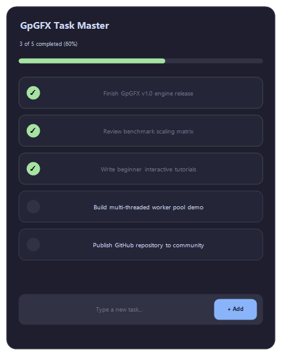
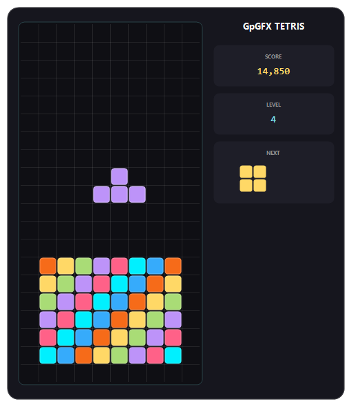
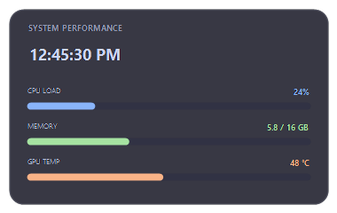
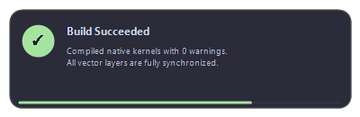
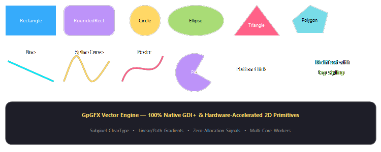
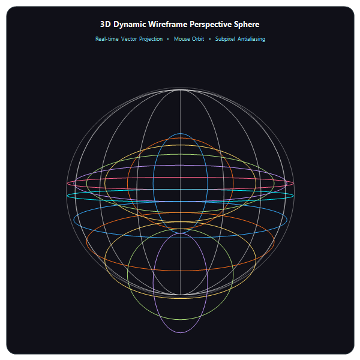
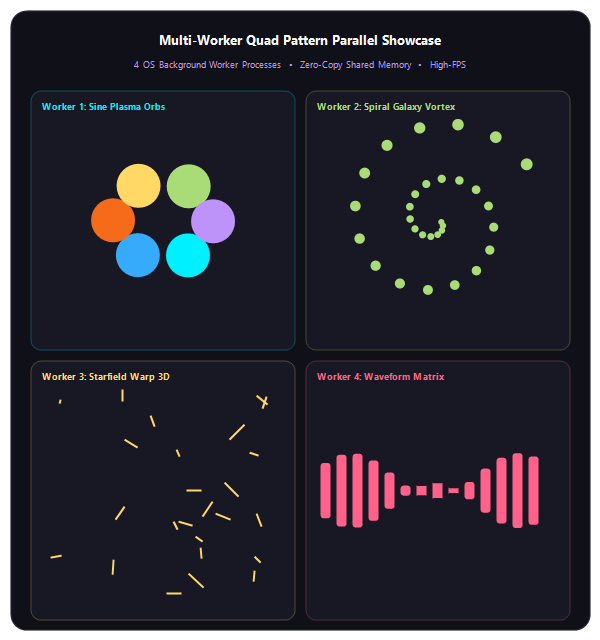
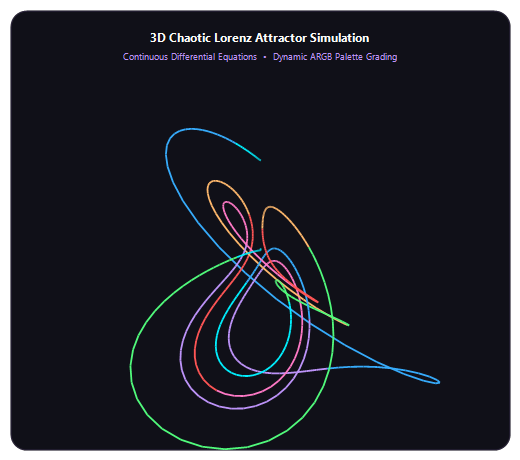

# GpGFX


**GpGFX is a 2D graphics engine, UI toolkit, and layered-window compositor for AutoHotkey v2.**

It turns the ugly parts of Win32 + GDI+ programming into a compact, chainable API for transparent desktop HUDs, animated overlays, custom widgets, dashboards, visualizers, and high-framerate applications.


<p align="center">
  &nbsp;&nbsp;&nbsp;&nbsp;
  
</p>

> **Draw vectors. Bind state. Animate everything. Ship the UI.**

---

## Why GpGFX?

Traditional AutoHotkey graphics code tends to become a pile of Win32 setup, GDI+ handles, manual invalidation, timers, and cleanup.

GpGFX is built around a different idea:

- **Declarative vector shapes** — rectangles, curves, text, images, buttons, containers, and more.
- **Layered rendering** — transparent ARGB DIBSections presented through layered windows.
- **Chainable layout** — `Center()`, `Shift()`, `Move()`, `Resize()`, corner alignment, and more.
- **Reactive state** — `Signal()` lets shapes bind directly to changing values.
- **Rich typography** — word wrapping, inline styling, tab-aligned columns, and word/range measurement.
- **Animation primitives** — delta-timed property animation, fades, roll transitions, and easing.
- **Color systems** — canonical ARGB parsing, HSL conversion, blending, gradients, LUTs, and curated palettes.
- **Bitmap access** — files, clipboard, HWND/screen capture, cloning, Scan0 pixel access, and filters.
- **High-resolution timing** — QPC-based frame pacing and frame telemetry.
- **Parallel work** — worker processes, shared memory IPC, and native machine-code kernels for expensive operations.

The result is an API that stays small at the call site while the engine handles the rendering machinery underneath.

---

## Quick Start

```autohotkey
#Requires AutoHotkey v2
#include GpGFX.ahk

lyr := Layer(500, 300).Center()

RoundedRectangle(500, 300, 16, "0xFF1E1E2E")
RoundedRectangle(500, 300, 16, "0xFF313244", false)

Text("Hello from GpGFX", "0xFFCDD6F4", 16, "Segoe UI", "Bold")
    .Center().Shift(0, -15)

Text("Click and drag anywhere to move | ESC to exit",
    "0xFFA6ADC8", 10)
    .Center().Shift(0, 15)

lyr.Drag().Draw()

Esc::ExitApp()
```

That's the basic mental model:

**Create a layer → create shapes → configure them → render.**

---

## Reactive UI in a Few Lines

`Signal` turns ordinary values into reactive state.

```autohotkey
#Requires AutoHotkey v2
#include GpGFX.ahk

lyr := Layer(400, 240).Center()
RoundedRectangle(400, 240, 14, "0xFF181825")

counter := Signal(0)

display := Text(
    0, 45, 400, 40,
    "Count: 0",
    "0xFF89B4FA", 22, "Segoe UI", "Bold"
).Center()

display.Bind(counter, (val, shp) => shp.str := "Count: " val)

Button(70, 125, 120, 38, "-1 Sub",
    (*) => counter.Value--,
    "0xFFF38BA8", "0xFF313244")

Button(210, 125, 120, 38, "+1 Add",
    (*) => counter.Value++,
    "0xFFA6E3A1", "0xFF313244")

lyr.Drag().Draw()
Esc::ExitApp()
```

No child GUI controls. No manual text invalidation. Bind state and let the shape update.

<p align="center">
  &nbsp;&nbsp;&nbsp;&nbsp;
  
</p>

---

# Core API Reference

This section is the **concise reference** for the core GpGFX modules.

## `Shape.ahk` & `Shapes.ahk`

**Base vector shape container, primitive shape factories, signal binding, event routing, and delta-timed transitions.**

### Shape factories

```text
Rectangle(x?, y?, w?, h?, color?, filled?)
RoundedRectangle(x?, y?, w?, h?, radius?, color?, filled?)
Square(x?, y?, size?, color?, filled?)
Circle(x?, y?, radius?, color?, filled?)
Ellipse(x?, y?, w?, h?, color?, filled?)
Triangle(x1, y1, x2, y2, x3, y3, color?, filled?)
Polygon(points, color?, filled?)
Line(x1, y1, x2, y2, color?, penwidth?)
Lines(points, color?, penwidth?)
Curve(points, color?, penwidth?, tension?)
Bezier(x1, y1, cx1, cy1, cx2, cy2, x2, y2, color?, penwidth?)
Pie(x, y, w, h, startAngle, sweepAngle, color?, filled?)
Text(x?, y?, w?, h?, str?, color?, size?, font?, style?)
Picture(x?, y?, w?, h?, fileOrBitmap?, resize?, effect?)
Button(x, y, w, h, label, onClick, hoverColor?, bgColor?)
Container(x, y, w, h)
```

<p align="center">
  
</p>

### Shape geometry & hierarchy

```text
shp.Move(x?, y?, w?, h?)        ; Moves or resizes the shape
shp.Position(x?, y?)            ; Centers or positions on layer: "center", integers, or floats
shp.Resize(option?, cmatrix?)   ; Resizes shape geometry
shp.BringToFront()              ; Moves shape to front of layer Z-order (renders on top)
shp.SendToBack()                ; Moves shape to back of layer Z-order (renders behind)
shp.Show() / shp.Hide() / shp.ShowHide()

; Computed edge & bounding properties (read-only)
shp.Right                       ; x + w
shp.Bottom                      ; y + h
shp.CenterX                     ; x + w / 2
shp.CenterY                     ; y + h / 2
shp.Bounds                      ; { x, y, w, h }
```

> [!NOTE]
> `shp.Position("center")` positions the shape on the parent layer. In contrast, methods like `shp.Center()`, `shp.TopLeft()`, and `shp.Shift()` below configure typographic text alignment *inside* the shape.

### Typographic & text alignment (inside shapes)

```text
shp.Text(str, color?, size?, font?, style?, quality?, alignH?, alignV?)
shp.TextAlign(h?, v?)           ; Text alignment: "left"|"center"|"right", "top"|"middle"|"bottom"
shp.Center()                    ; Aligns text to center of shape (not shape position)
shp.TopLeft() / shp.TopRight()  ; Aligns inner text to top-left / top-right
shp.BottomLeft() / shp.BottomRight() ; Aligns inner text to bottom-left / bottom-right
shp.Shift(dx, dy)               ; Offsets inner text (alias for shp.TextOffset)
shp.GetWordRect(word)           ; Returns exact bounding box of word
shp.GetCharPos(charIndex)       ; Returns caret coordinate for text editing
```

### Interactivity, state & animation

```text
shp.Hover(hoverColor, normalColor?)
shp.HoverAlpha(hoverAlpha, normalAlpha?)
shp.OnEvent(eventName, callback) ; "Click", "MouseEnter", "MouseLeave", "MouseMove"
shp.Bind(signal, updateCallback?)

shp.Animate(propName, targetVal, durationMs?, easing?)
shp.FadeIn(durationMs?)
shp.FadeOut(durationMs?)
shp.RollDown(durationMs?, easing?)
shp.RollUp(durationMs?, easing?)
```

### Signals

```text
Signal(initialValue)
Signal.Animate(signal, fromVal, toVal, durationMs, easing?)
```

Example:

```autohotkey
opacity := Signal(0)

panel.Bind(opacity, (value, shp) => shp.Alpha := value)
Signal.Animate(opacity, 0, 255, 300, "easeOutQuad")
```

---

## `Layer.ahk`

**Transparent layered-window manager, DIBSection lifecycle, message dispatching, and Z-order stack.**

A `Layer` is the core presentation surface in GpGFX. It allocates a 32-bit ARGB DIBSection backing buffer in memory and presents vector graphics directly through a native Win32 layered window (`WS_EX_LAYERED`). 

When a `Layer` is created, it automatically registers as `LayerStack.ActiveLayer`, allowing declarative shape builders (`Rectangle`, `Circle`, `Text`, `Picture`, etc.) to attach to it automatically.

### Constructor Overloads

```text
Layer(x?, y?, w?, h?, name?, hOwner?)
```

| Syntax | Dimensions & Position | Use Case |
| :--- | :--- | :--- |
| `Layer()` | `(0, 0, A_ScreenWidth, A_ScreenHeight)` | Fullscreen overlay or multi-monitor canvas |
| `Layer("HUD")` | `(0, 0, A_ScreenWidth, A_ScreenHeight)` | Fullscreen overlay with a friendly identifier |
| `Layer(w, h)` | Centered on primary display | Centered application cards, dialogs, widgets |
| `Layer(w, h, "HUD")` | Centered on primary display | Centered application window with a friendly identifier |
| `Layer(x, y, w, h, name?, hOwner?)` | Explicit coordinates `(x, y)` and size `(w, h)` | Fixed-position HUDs, child windows, docked toolbars |

```autohotkey
; Fullscreen transparent overlay
hud := Layer()

; Centered 600x400 window card
card := Layer(600, 400).Center()

; Explicit positioning with a parent owner window
toolbar := Layer(100, 50, 400, 60, "AppToolbar", mainHwnd)
```

### Execution & Rendering Pipeline (`lyr.Draw`)

The `lyr.Draw(trigger?, updateFn?)` method is the central execution router for presenting graphics to the screen:

```text
lyr.Draw(trigger?, updateFn?)
```

| Call Pattern | Behavior | Example |
| :--- | :--- | :--- |
| `lyr.Draw()` | Single-shot immediate hardware flush to screen via `UpdateLayeredWindow`. | `lyr.Draw()` |
| `lyr.Draw(intervalMs, updateFn?)` | Starts a recurring `SetTimer` frame loop. Calls `updateFn(this)` each tick, self-stopping if the window is closed. | `lyr.Draw(16, OnFrame)` |
| `lyr.Draw(-timeoutMs)` | Self-destructing Toast notification. Renders immediately and auto-disposes after `Abs(timeoutMs)`. | `lyr.Draw(-2500)` |
| `lyr.Draw(signal, updateFn?)` | Subscribes to a `Signal`. Fires `updateFn(val, this)` and renders immediately whenever the signal value changes. | `lyr.Draw(scoreSignal)` |
| `lyr.Draw(0)` / `lyr.Draw(false)` | Halts any active recurring interval timer on this layer (alias for `lyr.Stop()`). | `lyr.Draw(0)` |

#### Additional Rendering Methods

```text
lyr.DrawOnce(delayMs)           ; Schedules a deferred one-shot render after delayMs
lyr.Render()                    ; Renders one frame with QPC spin-wait pacing and FPS telemetry
lyr.Stop()                      ; Cancels active interval timer loops
lyr.Wait(timeoutMs?)            ; Synchronous modal display; blocks execution until closed or timed out
Layer.Draw()                    ; Static method: renders all active layers in LayerStack in Z-order
```

### Window Dragging & Hit Testing

GpGFX supports seamless window dragging without requiring Win32 titlebars:

```text
lyr.Drag(dragArea?)
```

```autohotkey
; 1. Drag by clicking anywhere on the layer
lyr.Drag()

; 2. Titlebar strip: only dragging within the top 40px moves the window
lyr.Drag(40)

; 3. Rectangular drag zone: specify an explicit bounding box {x, y, w, h}
lyr.Drag({x: 0, y: 0, w: 400, h: 48})

; 4. Multiple drag zones: array of bounding boxes
lyr.Drag([{x: 0, y: 0, w: 200, h: 40}, {x: 300, y: 0, w: 100, h: 40}])

; 5. Custom hit-test callback (this, mouseX, mouseY)
lyr.Drag((lyr, mx, my) => (my <= 50 && mx <= 300))
```

### Window Parenting, Docking & Desktop Pinning

```text
lyr.Attach(childLayer, offsetX, offsetY)
lyr.SnapToWindow(targetHwnd, edge?, offset?)
lyr.FollowWindow(targetHwnd, offsetX?, offsetY?)
lyr.AttachToDesktop()
lyr.DetachFromDesktop()
```

- **`lyr.Attach(child, offX, offY)`**: Docks a child layer to the parent. Moving the parent automatically moves all attached child layers with zero coordinate drift.
- **`lyr.SnapToWindow(hwnd, edge, offset)`**: Aligns the layer to the bounding box of any external Win32 window (edges: `"top"`, `"bottom"`, `"left"`, `"right"`).
- **`lyr.FollowWindow(hwnd, offX, offY)`**: Activates a high-frequency tracking loop that keeps the layer attached to a moving third-party window.
- **`lyr.AttachToDesktop()`**: Pins the layer behind desktop icons directly onto Windows Explorer's `WorkerW` / `Progman` wallpaper surface (Rainmeter-style live desktop widgets).
- **`lyr.DetachFromDesktop()`**: Restores a pinned desktop layer back to a standard desktop window.

### Geometry & Multi-Monitor Alignment

```text
lyr.Center()                     ; Centers layer on current screen or monitor
lyr.Move(x?, y?, w?, h?)         ; Repositions and/or resizes the window
lyr.Resize(w, h)                 ; Reallocates backing DIBSection and graphics buffers
lyr.SetMonitor(monitorIndex?, alignment?) ; Moves to specific display (e.g. 2, "center")
lyr.SyncPos()                    ; Re-synchronizes cached layer coordinates from native OS window position
```

### Window Styles & State

```text
lyr.ClickThrough                 ; Property (true/false) toggling WS_EX_TRANSPARENT (0x20)
lyr.Clickthrough(enable := true) ; Chainable method alias for ClickThrough
lyr.AlwaysOnTop                  ; Property (true/false) toggling HWND_TOPMOST
lyr.TopMost(enable := true)      ; Chainable method alias for AlwaysOnTop
lyr.NoActivate(enable := true)   ; Applies WS_EX_NOACTIVATE (0x08000000) so clicks never steal focus
lyr.Alpha                        ; Opacity level (0 - 255) passed to UpdateLayeredWindow
lyr.SetAlpha(val)                ; Immediately updates and synchronizes DWM window alpha
lyr.FadeIn(durationMs?, target?) ; Smoothly fades in layer (default 300ms, target 255)
lyr.FadeOut(durationMs?, onDone?); Smoothly fades out layer to 0 and hides it
lyr.BringToFront(shapeObj)       ; Moves a shape to top of layer Z-order
lyr.SendToBack(shapeObj)         ; Moves a shape to bottom of layer Z-order
lyr.SetQuality(preset)           ; Sets rendering quality ("low", "mid", "high")
lyr.Visible                      ; Visibility state
lyr.Show() / lyr.Hide() / lyr.ShowHide()
lyr.Activate()                   ; Brings window to foreground and gives focus
```

### Export & Direct Memory Access

```text
lyr.GetPixel(x, y)               ; Reads 32-bit ARGB pixel directly from raw pBits RAM (zero-copy)
lyr.ToBitmap(cropToContent?)     ; Returns a new independent GdipBitmap cloned from rendered surface
lyr.ToClipboard(cropToContent?)  ; Copies current 32-bit ARGB graphic to Windows Clipboard
lyr.toFile(filepath, crop?)      ; Saves layer to disk (PNG, JPEG, BMP, GIF, TIFF)
lyr.Dispose()                    ; Safely destroys GDI+ graphics, DIBSection, timers, and HWND
```

### Multi-Layer Coordination (`LayerStack`)

`LayerStack` tracks all live layers, orchestrates Z-order, and manages the active layer context:

```autohotkey
; Check or set the active layer used for declarative shape creation
activeLyr := LayerStack.ActiveLayer
LayerStack.ActiveLayer := backgroundLayer

; Swap Z-order between two layers
LayerStack.Swap(layerA, layerB)

; Emergency recovery: hides all active layers and makes them click-through
LayerStack.HideAll()

; Gracefully disposes all registered layers
LayerStack.DisposeAll()
```

### Comprehensive Examples

#### 1. Draggable App Window with Titlebar
```autohotkey
#Requires AutoHotkey v2
#include GpGFX.ahk

app := Layer(460, 280).Center()

; Background card
RoundedRectangle(460, 280, 14, "0xFF1E1E2E")
RoundedRectangle(460, 280, 14, "0xFF313244", false)

; Titlebar header (drag restricted to top 42px)
Rectangle(0, 0, 460, 42, "0xFF181825")
Text(20, 12, 400, 20, "GpGFX Application Window", "0xFFCDD6F4", 11, "Segoe UI", "Bold").Left()

; Content body
Text("Restricted titlebar dragging enabled.", "0xFFA6ADC8", 10).Center().Shift(0, 20)

; Enable drag on the top 42px strip only and present
app.Drag(42).Draw()

Esc::ExitApp()
```

#### 2. Non-Activating Click-Through HUD Overlay
```autohotkey
#Requires AutoHotkey v2
#include GpGFX.ahk

; Fullscreen click-through overlay that never steals focus from games or apps
hud := Layer()
hud.Clickthrough(true).NoActivate(true).TopMost(true)

; Render a subtle crosshair or telemetry in top-right
RoundedRectangle(A_ScreenWidth - 220, 30, 190, 60, 8, "0xCC11111B")
Text(A_ScreenWidth - 210, 42, 170, 36, "HUD Active`nClick-Through: True", "0xFF89B4FA", 9.5, "Segoe UI", "Bold").Center()

hud.Draw()

Esc::ExitApp()
```

#### 3. Self-Destructing Toast Notification Card
```autohotkey
#Requires AutoHotkey v2
#include GpGFX.ahk

ShowToast(msg, durationMs := 2500) {
    toast := Layer(320, 64)
    toast.Move(A_ScreenWidth - 340, A_ScreenHeight - 100)
    toast.TopMost(true).NoActivate(true)

    RoundedRectangle(320, 64, 10, "0xEE1E1E2E")
    RoundedRectangle(320, 64, 10, "0xFFA6E3A1", false)
    Text(16, 14, 288, 36, msg, "0xFFCDD6F4", 10, "Segoe UI", "Bold").Left().Middle()

    ; Negative duration renders immediately and automatically disposes after durationMs
    toast.Draw(-durationMs)
}

ShowToast("Build completed successfully!")
```

---

## `Color.ahk`

**Canonical ARGB parsing, color-space conversion, 4-channel blending, and pre-calculated gradient lookup tables.**

```text
Color(c?, alpha?)

Color.Alpha(color, a)
Color.AlphaF(color, a)
Color.Luminance(color)
Color.Contrast(bgColor)

Color.FromHSL(h, s, l, a?)
Color.ToHSL(color)

Color.Mix(c1, c2, weight?)
Color.Transition(c1, c2, dist?, alpha?)
Color.GetTransition(c1, c2, backforth?)

Color.Random(listOrHue?, variance?)
Color.RandomARGB()
Color.ChannelSwap(color, mode?)

Color.Buf(stops*)
colorBuffer.Sample(t)
```

### Color inputs

```autohotkey
rect.Color := "Crimson"
rect.Color := "SkyBlue"

rect.Color := "#FF5E36"       ; RGB
rect.Color := "#80FF5E36"     ; ARGB
rect.Color := "0xFF1E1E2E"    ; ARGB
rect.Color := 0xFF1E1E2E
```

### Gradients

```autohotkey
rect.Color := ["Gradient", "#FF5E36", "#FFAE34", 0]
rect.Color := ["Gradient", "#00F0FF", "#7122FA", 1]
```

Modes:

```text
0 = Horizontal
1 = Vertical
2 = ForwardDiagonal
3 = BackwardDiagonal
```

---

## `Palette.ahk`

**Curated four-color design themes with pre-computed continuous gradient sampling tables.**

Built-in palettes:

```text
Palette.Nord
Palette.Dracula
Palette.Catppuccin
Palette.TokyoNight
Palette.Monokai
Palette.Cyberpunk
Palette.Gruvbox
Palette.Solarized
```

Sampling:

```text
palette.Sample(t)
palette[indexOrFloat]
```

Example:

```autohotkey
accent := Palette.Catppuccin.Sample(0.5)
bg     := Palette.Nord[1]
```

---

## `Tool.ahk`

**Object-oriented wrappers for GDI+ raster tools, affine gradient transforms, and hatch styles.**

```text
Pen(ARGB, penwidth?, mode?)
SolidBrush(ARGB)
HatchBrush(foreColor, backColor?, hatchStyle?)
TextureBrush(pBitmap, wrapMode?, resize?, x?, y?, w?, h?)

LinearGradientBrush(
    foreColor, backColor,
    x?, y?, w?, h?,
    gradMode?, wrapMode?
)

LinearGradientBrush.Translate(dx, dy, order?)
LinearGradientBrush.Rotate(angle, order?)
LinearGradientBrush.Scale(sx, sy, order?)
LinearGradientBrush.SetPresetBlend(clrList, positions)

PathGradientBrush(
    pointsOrPath,
    centerColor?, surroundColor?, wrapMode?
)

PathGradientBrush.Radial(
    cx, cy, radius,
    centerColor?, surroundColor?, wrapMode?
)

PathGradientBrush.FromRect(
    x, y, w, h,
    centerColor?, surroundColor?
)

PathGradientBrush.SetCenter(x, y)
PathGradientBrush.SetFocusScales(xScale, yScale)
```

These tools are useful when a simple shape color isn't enough and you need explicit GDI+ brush or pen control.

---

## `TextLayout.ahk`

**Pure-math typography formatting, inline tag parsing, paragraph word wrapping, and subpixel character measurement.**

```text
TextLayout.Prepare(shape)
TextLayout.GetRangeRect(shape, startChar, charLen?)
```

This is the low-level text measurement layer behind rich text markup and precise word hitboxes (`shp.GetWordRect()`, `shp.GetCharPos()`).

---

## `Font.ahk`

**GDI+ Font, FontFamily, StringFormat, and cached typographic metric management.**

```text
Font(family?, size?, style?, color?, quality?, alignH?, alignV?)
Font.MeasureChar(fntObj, ch)
Font.MeasureString(fntObj, text)
Font.GetInstalledFonts()
Font.LoadFromFile(fontPath)
Font.DisposeAll()
```

Use `shp.Text()` on shapes for standard typographic setup, or `Font.MeasureString()` when evaluating raw string bounds.

---

## `Bitmap.ahk`

**GDI+ Bitmap and 32-bit DIBSection management, file I/O, cropping, clipboard transfer, and Scan0 pixel access.**

```text
GdipBitmap(source, height?, cmatrix?)

GdipBitmap.FromClipboard()
GdipBitmap.FromScreen(x?, y?, w?, h?)
GdipBitmap.FromHWND(hwnd, clientOnly?)
GdipBitmap.FromMemory(buffer, size)
GdipBitmap.FromHBITMAP(hbm, hPal?)
GdipBitmap.FromHICON(hIcon)

bmp.GetPixel(x, y, outFormat?)
bmp.SetPixel(x, y, color)
bmp.Clone(x?, y?, w?, h?)
bmp.Resize(option?, cmatrix?)
bmp.RotateFlip(flipMode)
bmp.ApplyLUT(lutB, lutG, lutR, lutA?)
bmp.PixelSearch(targetColor, variation?, x?, y?, w?, h?)

bmp.SaveToFile(filepath, format?, quality?)
bmp.ToFile(filepath, format?, quality?)
bmp.ToMemory(format?, quality?)
bmp.ToClipboard()
bmp.ToASCII(targetW?, targetH?, ramp?, colored?, doubleChar?)
bmp.Dispose()
```

Example:

```autohotkey
bmp := GdipBitmap(120, 80)
bmp.SetPixel(60, 40, 0xFFFF0000)

pic := Picture(50, 50, 200, 150)
pic.AddImage(bmp)
```

---

## `Graphics.ahk`

**GDI+ Graphics drawing contexts paired with 32-bit top-down ARGB DIBSection backing stores.**

```text
Graphics(w, h)

Graphics.FromHWND(hwnd, useICM?)
Graphics.FromHDC(hdc, hDevice?)

gfx.Dispose()
```

Most applications can stay at the shape/layer level; `Graphics` is the lower-level drawing context.

---

## `Draw.ahk`

**Rendering pipeline execution, GDI+ shape rasterization, and QPC-synchronized display loops.**

```text
Draw(lyr)

Render.Call(lyr)
Render.Layers(lyr1, lyr2, ...)
```

Conceptually:

```text
Shapes → Graphics → DIBSection → Layered Window
```

---

## `FrameTimer.ahk` & `Time.ahk`

**Sub-millisecond QPC delta timing, high-resolution frame pacing, and non-linear easing curves.**

```text
FrameTimer.Start(target, fps?, autoMode?)
FrameTimer.Stop()
FrameTimer.SetFPS(fps)
FrameTimer.Stats                ; { lastDeltaMs, avgFps, totalFrames }

Time.Now()                      ; High-precision timestamp in fractional seconds
Time.Since(startSec)            ; Elapsed milliseconds
Time.Qpc()                      ; Raw 64-bit performance counter
Time.Delay(ms)                  ; Responsive delay loop

Time.Ease.Linear(t)
Time.Ease.InQuad(t) / OutQuad(t) / InOutQuad(t)
Time.Ease.InCubic(t) / OutCubic(t) / InOutCubic(t)
Time.Ease.SmoothStep(t)
Time.Ease.Sine(t)
```

Use `Time.Since()` rather than assuming a fixed frame duration when animation correctness matters.

---

## `Fps.ahk`

**High-precision framerate monitoring, target FPS limiting, and telemetry tracking.**

```text
Fps.SetTarget(targetFps)
Fps.Position(pos?, x?, y?)      ; e.g. "topleft", "topright", 7, 9
Fps.Update()
Fps.Toggle()                    ; Cycles through preset FPS targets (30..1000)
Fps.Display(delayMs?)           ; Flashes temporary telemetry overlay
Fps.lastfps                     ; Instantaneous rendered FPS
Fps.frametime                   ; Target frame interval in ms
Fps.rendertime                  ; Last frame rasterization latency in ms
```

---

## `IPC.ahk`

**Win32 inter-process communication primitives: shared RAM mappings, named mutexes, and semaphores.**

### File mappings

```text
FileMapping(szName?, dwDesiredAccess?, flProtect?, dwSize?)
fileMapping.Write(data, offset?)
fileMapping.Read(buffer?, offset?, size?)
fileMapping.Close()
```

### Mutexes

```text
Mutex(name?, initialOwner?, securityAttributes?)

mutex.Lock(timeoutMs?)
mutex.Release()
mutex.Close()
```

### Semaphores

```text
Semaphore(initialCount?, maximumCount?, name?, securityAttributes?)

semaphore.Wait(timeoutMs?)
semaphore.Release(count?)
semaphore.Close()
```

These primitives underpin safe coordination between independent worker processes.

---

## `WorkerPool.ahk` & `Worker.ahk`

**Multi-process background rendering coordinator for vector rasterization and SIMD pixel searching across CPU cores.**

```text
WorkerPool.Init(workerCount?)
WorkerPool.AssignWorker(layerObj)

WorkerPool.StepWorker(workerIdx, dt?)
WorkerPool.PackLayer(lyr, workerIndex)

WorkerPool.AutoDispatch(lyr)
WorkerPool.Dispatch(lyr, workerIndex)

WorkerPool.WaitForAll(timeoutMs?)

WorkerPool.Composite(targetLayer, layers*)

WorkerPool.Shutdown()
```

The intended workflow is:

```text
Main process
    │
    ├── Layer / scene
    │
    └── WorkerPool
          ├── Worker 0
          ├── Worker 1
          ├── Worker 2
          └── ...
```

Use the worker pool when the workload is large enough that process-level parallelism is worth the coordination cost.

---

## `MCode.ahk`

**Native executable machine-code loader and vectorized C-kernel integration from `src/`.**

```text
MCode.Call(base64Code)
MCode.InitQPC()
MCode.QpcSpinWait(targetTicks)
MCode.InitHiResTimer()
MCode.HiResWait(ms)
MCode.BatchComputeBounds(pPoints, count, outBoundsBuf?)
MCode.BatchTranslate(pPoints, count, dx, dy)
```

The native side contains performance-sensitive kernels for timing, geometry, coordinate transforms, and pixel operations.

---

## `Function.ahk`

**Desktop capture, monitor geometry, DWM window bounds, and coordinate helpers.**

```text
CreateGraphicsObject(rows?, cols?, x?, y?, w?, h?, pad?, color?, layer?)
Clean()                         ; Clears and cleans all active layer windows
Clear()                         ; Alias for Clean()
SaveLayer(lyr, filepath)        ; Exports layer surface to disk
Screenshot(filepath?, x?, y?, w?, h?) ; Desktop or regional screen capture
GetMonitorInfo()                ; Multi-monitor geometry enumeration
WinGetVisiblePos(hwnd, &x?, &y?, &w?, &h?) ; True visible bounds via DWM
PositionByNumber(numpadDigit)   ; 7=topleft, 9=topright, 1=bottomleft, etc.
```

---

## `Debug.ahk`

**Telemetry metrics collector, memory working-set query, and CPU core diagnostics.**

```text
GpGFX.DebugLog(message)

Debug.Register(name, collectorFn)
Debug.Unregister(name)
Debug.Poll()
Debug.GetSummary()              ; Pre-formatted telemetry string
Debug.GetPhysicalCoreCount()
Debug.GetLogicalProcessorCount()
```

---

## `GpGFX.ahk`

**Master entry point, GDI+ token startup/shutdown lifecycle, and global system configuration.**

```text
Gdip.Startup()
Gdip.Shutdown()

GpGFX.version                   ; "1.0.0"
GpGFX.debug                     ; Boolean debug toggle
GpGFX.DebugLog(msg)

End()                           ; Disposes layers and exits
```

Normally, applications should simply include `GpGFX.ahk` rather than manually initializing each core subsystem.

---

# Shapes in Practice

All shape factories register against the active `Layer`.

| Primitive | Signature | Typical use |
|---|---|---|
| `Rectangle` | `Rectangle(x?, y?, w?, h?, color?, filled?)` | Cards, panels, bars |
| `RoundedRectangle` | `RoundedRectangle(x?, y?, w?, h?, radius?, color?, filled?)` | Modern UI surfaces |
| `Square` | `Square(x?, y?, size?, color?, filled?)` | Equal-sided blocks |
| `Circle` | `Circle(x?, y?, radius?, color?, filled?)` | Dots, avatars, indicators |
| `Ellipse` | `Ellipse(x?, y?, w?, h?, color?, filled?)` | Ovals, effects |
| `Triangle` | `Triangle(x1, y1, x2, y2, x3, y3, color?, filled?)` | Arrows, geometry |
| `Polygon` | `Polygon(points, color?, filled?)` | Arbitrary vector geometry |
| `Line` | `Line(x1, y1, x2, y2, color?, penwidth?)` | Strokes |
| `Lines` | `Lines(points, color?, penwidth?)` | Polylines |
| `Curve` | `Curve(points, color?, penwidth?, tension?)` | Smooth paths |
| `Bezier` | `Bezier(x1, y1, cx1, cy1, cx2, cy2, x2, y2, color?, penwidth?)` | Controlled curves |
| `Pie` | `Pie(x, y, w, h, startAngle, sweepAngle, color?, filled?)` | Gauges, charts |
| `Text` | `Text(x?, y?, w?, h?, str?, color?, size?, font?, style?)` | Typography |
| `Picture` | `Picture(x?, y?, w?, h?, fileOrBitmap?, resize?, effect?)` | Images |
| `Button` | `Button(x, y, w, h, label, onClick, hoverColor?, bgColor?)` | Interaction |
| `Container` | `Container(x, y, w, h)` | Logical grouping |

### Layout

```autohotkey
rect := RoundedRectangle(
    50, 50, 200, 100,
    12, "0xFF89B4FA"
)

rect.x := 100
rect.y := 120
rect.w := 250
rect.h := 120

rect.Filled := true
rect.penwidth := 2.0
rect.radius := 16
rect.Alpha := 200
rect.Visible := true

rect.Center()
rect.TopLeft()
rect.BottomRight()

rect.Center().Shift(0, -20)
```

---

# Rich Text

Text supports inline color/style markup and tab-aligned columns.

```autohotkey
Text(
    35, 40, 550, 240,
    "<b>SUBSYSTEM`tSTATE`tLATENCY</b>`n"
    . "GDI+ RenderCore`t{#A6E3A1}Active{reset}`t{#89B4FA}0.2 ms{reset}`n"
    . "Memory DIBSection`t{#A6E3A1}Active{reset}`t{#89B4FA}0.1 ms{reset}`n"
    . "MCode QPC Pacing`t{#A6E3A1}Paced{reset}`t{#FAB387}16.6 ms{reset}",
    "0xFFCDD6F4",
    11,
    "Consolas"
).Left()
```

Supported tags include:

```text
{#HEX}
{ColorName}
<b>Bold</b>
<i>Italic</i>
<u>Underline</u>
<s>Strike</s>
{reset}
```

Word-level geometry is available when building custom interactions:

```autohotkey
box := card.GetWordRect("OPTIMAL")

if box.found {
    RoundedRectangle(
        box.x - 4,
        box.y - 2,
        box.w + 8,
        box.h + 4,
        4,
        "0x44FAB387"
    )
}
```

---

# Images & Pixel Access

```autohotkey
; File-backed image
pic := Picture(
    50, 50, 200, 150,
    "assets/wallpaper.png"
)

; Image attached to an existing shape
rect := RoundedRectangle(
    50, 50, 200, 150,
    12, "0xFF313244"
)

rect.AddImage(
    "assets/avatar.png",
    100,
    "Grayscale"
)
```

Supported image effects include:

```text
Grayscale
Invert
Sepia
```

For direct pixel manipulation:

```autohotkey
bmp := GdipBitmap(120, 80)

bmp.SetPixel(60, 40, 0xFFFF0000)

color := bmp.GetPixel(60, 40)
```

---

# Events & Interaction

Interactive shapes use event routing rather than creating a Win32 child control for every button.

```autohotkey
btn := RoundedRectangle(
    50, 50, 160, 40,
    8, "0xFF313244"
)

btn.Text(
    "Hover Me",
    "White",
    11,
    "Segoe UI",
    "Bold"
)

btn.Hover(
    "0xFF89B4FA",
    "0xFF313244"
)

btn.HoverAlpha(255, 150)

btn.OnEvent(
    "Click",
    (*) => MsgBox("Button Clicked!")
)

btn.OnEvent(
    "MouseEnter",
    (*) => SoundBeep(1200, 30)
)
```

Available event names include:

```text
Click
DoubleClick
MouseEnter
MouseLeave
MouseDown
MouseUp
```

For the common case, use:

```autohotkey
Button(
    50, 105, 160, 40,
    "Confirm Action",
    (*) => OnConfirm(),
    "0xFFA6E3A1",
    "0xFF313244"
)
```

---

# Animation

Animations are delta-timed, so they are not tied to a single assumed frame rate.

```autohotkey
panel := RoundedRectangle(
    50, 50, 300, 180,
    12, "0xFF1E1E2E"
)

panel.RollDown(500, "easeOut")
panel.RollUp(400, "easeIn")

panel.FadeIn(300)
panel.FadeOut(300)

panel.Animate(
    "x",
    50,
    300,
    600,
    "bounce"
)

panel.Animate(
    "w",
    300,
    500,
    400,
    "easeOutQuad"
)
```

Available easing functions exposed by `Time.Ease`:

```text
Linear
InQuad
OutQuad
InOutQuad
Sine
Bounce
```

---

## `Dialog.ahk`

**Modern minimalist vector modal dialogs and input boxes with rich text formatting, theme palettes, and fluid button interactions.**

### `Dialog.MsgBox`

```autohotkey
; Simple notification dialog
btn := Dialog.MsgBox("Operation completed successfully.", "Status", "OK")

; Yes/No modal with warning icon and Nord theme
if (Dialog.MsgBox("Do you want to delete this profile?", "Confirm", "YesNo IconWarn", { theme: "Nord" }) == "Yes") {
    ; Handle confirmation...
}
```

### `Dialog.Input`

```autohotkey
; Vector InputBox with placeholder and Catppuccin theme
name := Dialog.Input("Enter project title:", "New Project", "My App", "Title...", { theme: "Catppuccin" })
if (name !== false) {
    ; Handle input...
}
```

---

# Layer Architecture

A useful way to think about GpGFX is:

```text
                    ┌──────────────────────┐
                    │      Your Script     │
                    └──────────┬───────────┘
                               │
                    ┌──────────▼───────────┐
                    │ Shapes / Signals / UI│
                    └──────────┬───────────┘
                               │
                    ┌──────────▼───────────┐
                    │   Draw / Graphics    │
                    └──────────┬───────────┘
                               │
                    ┌──────────▼───────────┐
                    │ ARGB DIBSection      │
                    └──────────┬───────────┘
                               │
                    ┌──────────▼───────────┐
                    │ Layered Win32 Window │
                    └──────────┬───────────┘
                               │
                    ┌──────────▼───────────┐
                    │ Windows DWM / Desktop│
                    └──────────────────────┘
```

A `Layer` is an invisible sheet of glass:

- place shapes on it;
- render it as a transparent window;
- drag it when needed;
- make it click-through;
- pin it to the desktop;
- resize it without maintaining a giant fullscreen canvas.

Multiple layers can be useful when different parts of an application have different update rates or interaction models.

Examples:

```text
Layer A → static UI
Layer B → 120 FPS particles
Layer C → click-through crosshair
Layer D → self-destructing toast
```

---

# Performance-Oriented Design

GpGFX is engineered around low-overhead memory layout, deterministic frame pacing, and multi-core parallelism:

### Exact-size backing stores

The engine dynamically allocates the minimum 32-bit pixel buffer required by the layer instead of forcing every scene into a fullscreen canvas. A 500×300 ARGB surface requires roughly 600 KB for its pixel buffer.

### High-resolution timing & pacing

QPC-based timing and native MCode spin-waiting provide sub-millisecond frame deltas and jitter-free pacing for animation loops without thread-scheduling drift.

### Native MCode hot paths

Performance-critical vector calculations (batch bounding-box culling, point translation, SIMD memory PixelSearch, and 256-entry channel lookup tables) are executed via native x64 machine code compiled directly from `src/`.

### Parallel workloads & worker processes

`WorkerPool` and `IPC` distribute vector rasterization, particle simulation, and memory searches across dedicated background OS processes communicating via Win32 `FileMapping` shared memory and hardware semaphores.

<p align="center">
  &nbsp;&nbsp;&nbsp;&nbsp;
  
</p>

### Cached typography

Font metrics and text layout character advances are cached in memory, eliminating GDI+ typographic query overhead during continuous render loops.

---

# Installation

## Requirements

- **AutoHotkey v2.0+ (64-bit)**
- **Windows 10 or Windows 11, 64-bit**

## Include GpGFX

### Same directory

```autohotkey
#Requires AutoHotkey v2
#include GpGFX.ahk
```

### Relative subfolder

```autohotkey
#Requires AutoHotkey v2

#include ..\GpGFX.ahk
; or
#include ..\..\GpGFX.ahk
```

### AutoHotkey user library

Copy the repository to:

```text
%USERPROFILE%\Documents\AutoHotkey\Lib\GpGFX\
```

Then:

```autohotkey
#Requires AutoHotkey v2
#include <GpGFX>
```

---

# Example Catalog

## Beginner tutorials

Located in `tutorials/__Basics/`:

1. `01_Layer_and_Window.ahk` — transparent window setup, sizing, dragging, and topmost defaults.
2. `02_Basic_Shapes.ahk` — rectangles, circles, lines, splines, fills, and strokes.
3. `03_Colors_and_Gradients.ahk` — color formats, linear gradients, and design palettes.
4. `04_Typography_and_RichText.ahk` — rich text markup, pure-math wrapping, and tab columns.
5. `05_Interactivity_and_Hover.ahk` — hover alpha transitions, click events, and button components.
6. `06_Signals_and_Animation.ahk` — reactive `Signal` data binding and delta-timed easing.
7. `07_Images_and_Bitmaps.ahk` — procedural bitmaps, filters, and Scan0 pixel access.

## Advanced showcases

Located in `examples/demos/`:

- `DynamicGradientSphere.ahk` — real-time 3D wireframe perspective projection with mouse orbit.
- `MouseTrail.ahk` — zero-allocation cursor particle trails and spring physics.
- `DesktopWidgetDemo.ahk` — pinned desktop HUD with live system memory, clock, and RAM trimming.
- `ToastNotificationDemo.ahk` — 1-line self-destructing animated toast cards (`lyr.Draw(-2000)`).
- `LorenzAttractor.ahk` — 3D chaotic attractor simulation with dynamic palette grading.
- `AsyncLayer_Showcase.ahk` — multi-core particle simulation across background workers.
- `MultiWorker_QuadPattern.ahk` — 4-quadrant parallel worker rasterization.
- `RichTextStyleShowcase.ahk` — inline markup styling and subpixel word bounding boxes.
- `TextRangeMeasureDemo.ahk` — clickable/hoverable text hyperlinks via pure-math bounding boxes.
- `BitmapToASCII.ahk` — vector rasterization converted into TrueColor ASCII art.
- `QualityPresetDemo.ahk` — live anti-aliasing quality comparison.
- `StaticCube.ahk` — isometric 3D wireframe cube construction.
- `PathGradientShowcase.ahk` — radial and polygonal path gradients with custom focus scales.

<p align="center">
  
</p>

## Interactive applications

Located in `examples/apps/`:

- `TetrisGame.ahk` — classic arcade puzzle game rendered entirely via GpGFX vector layers.
- `TodoApp.ahk` — modern dark-mode task manager with animated UI feedback.

## Performance benchmarks

Located in `benchmarks/`:

- `ColorNames.ahk` — high-throughput color cache reflection and shape jitter benchmark.
- `FractalTree.ahk` — recursive shape allocation, rendering, and disposal stress test.
- `LorenzSystem.ahk` — sustained numerical math and continuous polyline overdraw loop.
- `ObjectGrid.ahk` — batch grid allocation and sequential draw throughput.

---

# Repository Layout

```text
GpGFX/
├── GpGFX.ahk                   ; Master engine entry point (single root .ahk)
├── README.md
├── LICENSE
├── AGENTS.md
├── .gitignore
│
├── assets/                     ; Visual showcase media & documentation assets
├── core/                       ; Internal engine implementation (21 modules)
│   ├── Layer.ahk               ; Transparent layered-window manager
│   ├── Shape.ahk               ; Base shape class, Signals, and animation
│   ├── Shapes.ahk              ; Concrete vector primitives (Rect, Circle, etc.)
│   ├── Color.ahk               ; ARGB parser, blending, HSL, ColorBuffer, ColorLUT
│   ├── Palette.ahk             ; Curated themes (Catppuccin, Nord, Dracula, etc.)
│   ├── Tool.ahk                ; Pens, SolidBrush, HatchBrush, Gradients
│   ├── TextLayout.ahk          ; Pure-math typographic layout & wrapping
│   ├── Font.ahk                ; GDI+ Font cache & measurement
│   ├── Bitmap.ahk              ; 32-bit GdipBitmap, file I/O, PixelSearch
│   ├── Graphics.ahk            ; GDI+ Graphics context & DIBSections
│   ├── Draw.ahk                ; Rasterization pipeline & Render pacing
│   ├── FrameTimer.ahk          ; High-precision thread-pacing controller
│   ├── Time.ahk                ; QPC timestamps & easing curves
│   ├── Fps.ahk                 ; Framerate limiter & on-screen overlay
│   ├── IPC.ahk                 ; FileMapping, Mutex, Semaphore primitives
│   ├── Worker.ahk              ; Multi-process background worker script
│   ├── WorkerPool.ahk          ; Multi-core worker pool director
│   ├── MCode.ahk               ; x64 machine code loader & QPC spin-wait
│   ├── Function.ahk            ; Screen capture, monitor geometry, DWM bounds
│   ├── Debug.ahk               ; Engine telemetry & diagnostics
│   └── Dialog.ahk              ; Modern minimalist vector MsgBox & Input dialogs
│
├── src/                        ; Native C kernels (compiled to MCode / DLL)
│   ├── bounds.c                ; Vectorized 2D bounding box calculator
│   ├── colorlut.c              ; 256-entry channel lookup table kernel
│   ├── pixelsearch.c           ; x64 SIMD memory PixelSearch engine
│   ├── qpc_spin.c              ; Hardware pause spin-wait assembly
│   ├── throttle.c              ; Native frame pacing DLL source
│   └── translate.c             ; Vectorized 2D point translation kernel
│
├── examples/
│   ├── demos/                  ; Advanced visual showcases & demos
│   └── apps/                   ; Complete desktop applications (Tetris, TodoApp)
│
├── tutorials/                  ; Targeted module-level learning guides
│   ├── __Basics/               ; Progressive beginner tutorials (01-07)
│   ├── Font/
│   ├── Layer/
│   └── Signal/
│
└── benchmarks/                 ; Performance benchmark suites
    ├── ColorNames.ahk
    ├── FractalTree.ahk
    ├── LorenzSystem.ahk
    └── ObjectGrid.ahk
```

---

# Frequently Asked Questions & Troubleshooting

### Why does my window disappear when I add shapes?
Shapes are rasterized into their parent `Layer`'s DIBSection buffer. If you position a shape outside the layer's width and height (e.g. `x := 1000` on a 500px wide layer), GpGFX automatically culls it from rendering. Ensure your layer dimensions (`Layer(w, h)`) encompass all child shapes, or call `lyr.Resize(newW, newH)`.

### How do I prevent mouse clicks from hitting the desktop behind my transparent layer?
By default, transparent areas of a layered window pass clicks through to underlying windows. If you want a shape or card to capture clicks, attach an event handler (`shp.OnEvent("Click", handler)`) or ensure `lyr.ClickThrough` is `false`.

### What happens if an unhandled error occurs in my script?
GpGFX installs a fail-safe unhandled error hook (`Gdip.__New`). If an unhandled exception occurs anywhere in your script, `LayerStack.HideAll()` immediately hides all active layered windows and enables click-through transparency, ensuring you are never locked out of your desktop.

### Why AutoHotkey v2?
GpGFX is built exclusively for AutoHotkey v2 (64-bit), taking full advantage of modern object-oriented syntax, fat-arrow functions, structured exceptions.

---

# Design Philosophy

GpGFX is deliberately layered.

**High-level code should look like UI code.**

```autohotkey
panel := RoundedRectangle(
    40, 40, 420, 240,
    18, Palette.Catppuccin[1]
)

title := Text(
    "System Status",
    "White",
    18,
    "Segoe UI",
    "Bold"
).Center()

title.Shift(0, -60)

panel.FadeIn(250)
```

**Low-level code should exist only when you actually need it.**

When you need raw pixels, reach for `Bitmap`.

When you need explicit GDI+ resources, use `Tool`.

When you need a custom drawing context, use `Graphics`.

When you need timing, use `FrameTimer` / `Time`.

When you need process coordination, use `IPC` / `WorkerPool`.

When you need native hot paths, use `MCode`.

The common case stays clean. The engine remains accessible all the way down.

---

# Contributing

Contributions, experiments, performance improvements, bug fixes, and new examples are welcome.

When contributing:

- keep public APIs small and consistent;
- prefer chainable operations where appropriate;
- avoid unnecessary per-frame allocations;
- keep rendering and timing paths deterministic;
- document new public methods in the API reference;
- include a focused example when adding a user-facing feature.

---

# Community & Credits

Special thanks to the AutoHotkey community and the projects that helped inspire parts of GpGFX's architecture and implementation:

- **iseahound** — inspiration from Graphics, TextRender, and ImagePut.
- **tic (Tariq Porter)** — creator of the original AutoHotkey Gdip library.
- **AHKv2-Gdip contributors** — mmikeww, buliasz, nnnik, AHK-just-me, sswwaagg, Rseding91.
- **robodesign (Marius Șucan)** — Gdip2 path and geometry algorithms.
- **G33kDude** — Chrome.ahk.
- **Helgef, mcl, neogna2, SKAN, Descolada** — additional AutoHotkey ecosystem contributions.
- **Lexikos** — AutoHotkey v2.

---

# License

GpGFX is released under the **MIT License**.

See [`LICENSE`](LICENSE) for the full license text.